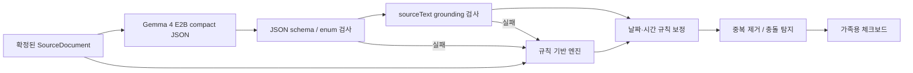

# AI 보조 구조화 파이프라인

## 목적과 경계

Gemma 4는 사용자가 제공한 자료에서 이미 명시된 확인사항을 분류하는 보조 도구다. 의료 진단, 처방 변경, 약 중단 권고, 응급 판단을 생성하지 않는다. 모델 결과는 단독으로 사용하지 않고 브라우저의 결정론적 검증 단계를 통과한 항목만 채택한다.

## 구성



## Provider 경계

- 클라우드: private loopback의 `cloud/wavelab_ai_service.py`
- 모델: `gemma4:e2b` (Ollama)
- 로컬 BFF: `scripts/wavelab_server.py`
- 전송: WSL `scripts/start.sh`가 SSH local forward로 `127.0.0.1:11435 → cloud:8000`을 연다.
- 브라우저: `/api/capabilities`, `/api/analyze`, `/api/extract/image`, `/api/transcribe/audio`만 호출한다.

브라우저 번들에는 API 키, SSH 키, 클라우드 주소 인증정보가 포함되지 않는다. 터널을 열 수 없으면 BFF는 AI 미가용 상태를 반환하고 앱은 기존 규칙 엔진으로 동작한다.

## Gemma 출력 계약

Gemma에는 짧은 compact JSON만 요청한다.

```json
{
  "items": [
    {
      "category": "medication",
      "sourceDocumentId": "manual-memo",
      "sourceText": "혈압약은 아침 식후 복용."
    }
  ]
}
```

클라우드 gateway가 이를 `CaseAnalysis` 초안으로 확장하고, [case-analysis.schema.json](../schemas/case-analysis.schema.json)의 필수 필드를 채운다. 클라이언트 `src/engine.js`의 `validateLLMAnalysis`는 다음을 검사한다.

1. 5개 허용 category와 priority enum
2. confidence 범위
3. sourceDocumentId 또는 sourceText로 찾을 수 있는 입력 자료
4. sourceText가 실제 원문에 존재하는지
5. 날짜·시간이 원문 추출 규칙과 일치하는지

검사 실패 항목은 버리고 규칙 기반 결과를 유지한다. JSON 파싱 실패 시 gateway가 한 번만 JSON 재요청을 수행한다.

## Live 검증

합성 자료만 사용해 Gemma 4 실제 요청을 확인한다.

```powershell
powershell -NoProfile -ExecutionPolicy Bypass -File scripts/test-ai.ps1
```

기본 `verify`에는 네트워크 의존 live test를 넣지 않는다. 대신 mock contract·grounding·conflict 검증을 포함한다.
