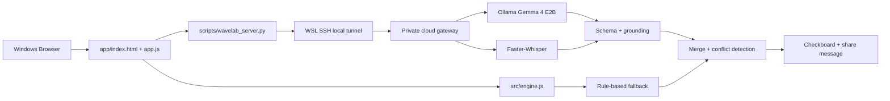

# 아키텍처

## 전체 구성



## 화면 구조

상단의 전역 탭은 `새 기록`, `체크보드`, `공유문`, `검증 정보`다. URL hash와 연결되어 직접 접근과 브라우저 탐색이 가능하다. `새 기록`의 하위 입력 탭은 직접 입력·사진·음성으로 분리되지만 서로 배타적이지 않다. 확정된 source만 한 번의 통합 분석으로 합친다.

## 도메인 모델

### SourceDocument

```text
id, type(manual | vision | audio_transcript | ocr), label,
text, confidence, confirmed, createdAt
```

### ActionItem

기존 `id`, `category`, `title`, `detail`, `dueDate`, `dueTime`, `priority`, `confidence`, `sourceText`, `assignee`, `completed` 외에 다음 provenance 필드를 사용한다.

```text
sourceDocumentId, sourceStart, sourceEnd, needsReview
```

### Conflict

```text
field, values, sourceIds, message
```

재방문 또는 검사 날짜가 서로 다른 source에서 다르면 자동 생성한다.

## Hybrid pipeline

1. 브라우저가 text/이미지/음성 input을 검증한다.
2. 사진·음성은 Gemma Vision/Faster-Whisper가 text 초안을 만들고 사용자가 수정·확정한다.
3. 확정된 `SourceDocument`의 개인정보 유사 패턴을 탐지한다.
4. Gemma 4가 compact semantic 분류 JSON을 반환한다.
5. `validateLLMAnalysis`가 schema, enum, confidence, source grounding, 날짜·시간을 검사한다.
6. 같은 source에 대한 결정론적 rule item으로 날짜·시간·priority를 보정한다.
7. 중복을 제거하고 source 간 날짜 충돌을 surface한다.
8. 체크보드와 공유문을 생성한다.

LLM 결과가 없거나 파싱·grounding에 실패하면 4~5단계를 건너뛰고 규칙 기반 결과로 계속한다.

## 저장과 보존

브라우저 MVP는 작성 중 상태를 메모리에만 둔다. 클라우드 gateway는 파일을 영구 저장하지 않는다. 음성 파일은 전사를 위한 임시 파일로만 만들고 요청 종료 시 삭제한다. 추후 persistence가 필요하면 `Case`, `SourceDocument`, `ActionItem`, `PrivacyWarning`, `Conflict` 경계를 SQLite 또는 서버 repository로 옮길 수 있다.

## OCR adapter

현재 검증된 이미지 추출은 Gemma 4 Vision이다. 전용 OCR provider는 향후 `extract/image` adapter에 병행 연결할 수 있으며, 서로 다른 추출문은 하나를 강제로 선택하지 않고 review/conflict로 남기는 구조다.
